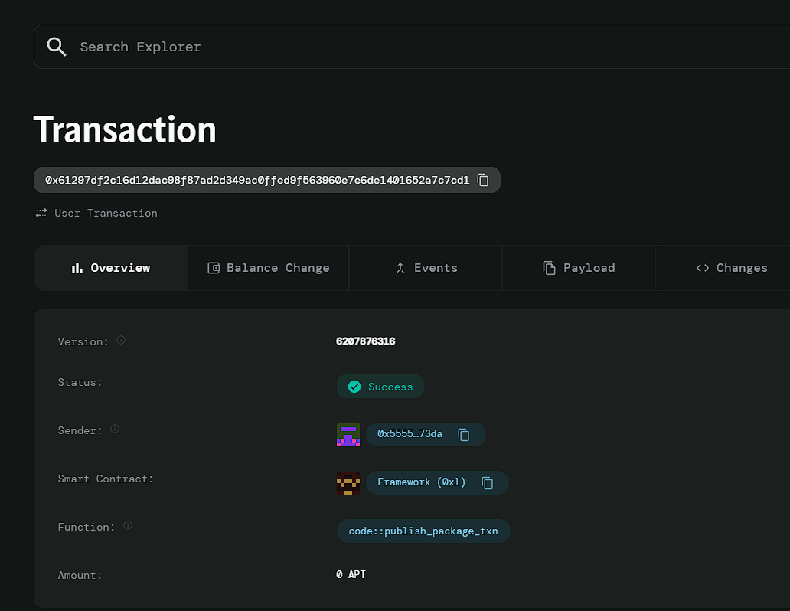

# NFT Marketplace

# Deployed ID: 0x61297df2c16d12dac98f87ad2d349ac0ffed9f563960e7e6de1401652a7c7cd1

## Project Description
A decentralized platform allowing artists and creators to mint, buy, and sell NFTs, representing digital art, collectibles, and unique digital items. The platform ensures creators receive royalties on resale, encouraging sustained engagement and benefit from their creations' ongoing popularity.

## Project Vision
To empower creators by providing a secure, automated marketplace where they can monetize their digital creations and benefit from continued royalty payments, fostering a transparent and equitable ecosystem for NFT transactions.

## Key Features
- **NFT Minting**: Creators can mint unique NFTs with specified royalty percentages.
- **Automated Royalties**: The smart contract calculates and distributes royalties to creators on each resale.
- **Decentralized Transactions**: Users can buy and transfer NFTs directly, ensuring secure ownership transfers without intermediaries.
